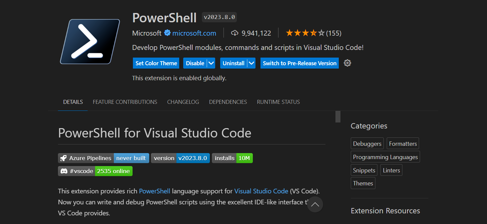
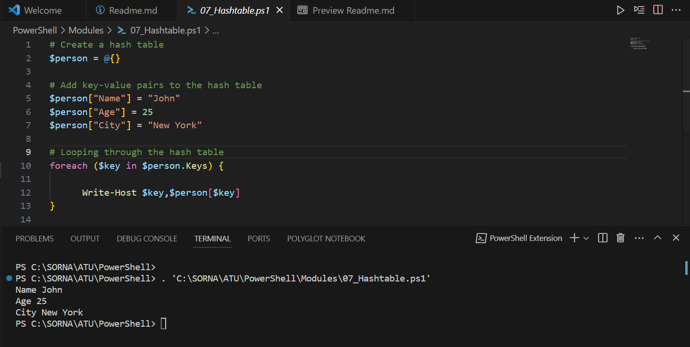
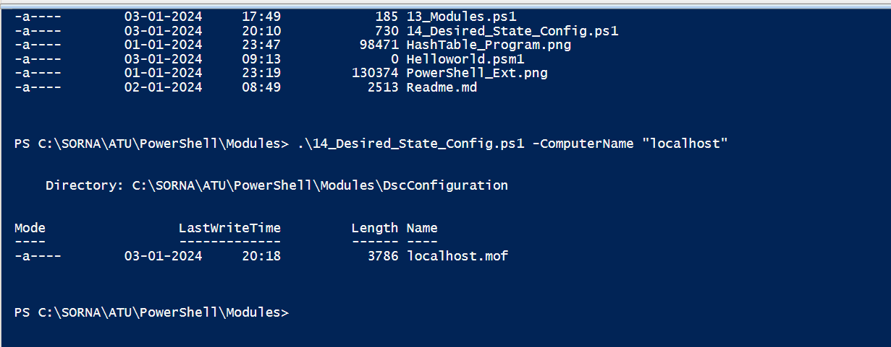

# Overview

PowerShell is a powerful scripting language designed  by Microsoft  for task automation and configuration management.PowerShell can be installed and run on variou platforms such as Windows,Linux and Mac.
This exercise  lists the various PowerShell programs.Few of the programs listed provides basic programming concepts wheras others details the advanced use cases of programming language.Using PowerShell user can create scripts and commands to perform different tasks such as manipulating data, managing files and directories and even automation of different administrative tasks. PowerShell is extensively used by system administrators and developers to perform automated repetitive tasks.

## Programming Language:

+ Powershell version 7.4

## Prerequisites

In Powershell the execution policy is a security feature that determines the conditions under which PowerShell loads configuration files and runs scripts, hence as pre requisite the following command needs to executed to allow execution of local scripts on the windows machine

+ Set -ExecutionPolicy -ExecutionPolicy RemoteSigned -Force

+ Windows 10 Virtual Machine created using VMWare workstation 17 pro

+ Windows Server 2016 Virtual Machine created using VMWare workstation 17 pro

  
  
## Installation

+ Visual Studio Code IDE used to manage project and different powershell scripts.To run PowerShell from the Visual Studio Code navigate to Extensions and search -> PowerShell-> Select version 2023.8.0 by Microsoft and install
  

## Usage

1. Each ".ps1" file has no dependency on other".ps1" program (except one program name Module)
3. PowerShell commands can be executed as single command or whole file as a script file
4. To perform Single command execution from a .ps1 file select the commands and Run
5. To perform execution of all commands within a file, simply Run the file
6. The output of each run will be displayed in the console

   
## Configuration
Extract the zip project in C:\PowerShell folder.Open Visual Studio code and select File-> Add  Folder to Workspace.Windows Browse folder window will pop up.Select the folder and click Add.Project folder will be successfully added to workspace

## Example

  

- Desired State Configuration example
    

## Important Notes
    - The program needs read permissions for the configuration files
    - Please include csv files for Active Directory users creation
    - Desired State Configuration .MOF files can be located at DSCConfiguration directory

## Source Code file name
1. 01_Setup.ps1
2. 02_Download Powershell7.ps1
3. 03_Install Powershell7.ps1
4. 04_Variables.ps1
5. 05_ConditionalBranching.ps1
6. 06_Loops.ps1
7. 07_Arrays_and_Arraylist.ps1
8. 08_Hashtable.ps1
9. 9_1_Remoting.ps1
10. 9_2_Build_AD.ps1
11. 9_3_Build_DC1.ps1
12. 9_4_Build_DC2.ps1
13. 9_5_Createuser.ps1
14. 9_6_DHCP.ps1
15. 10_ErrorHandling.ps1
16. 11_Desired_State_Config.ps1
17. 12_Apply_DSC_Config.ps1
18. 13_Remove_DSC_Config.ps1
19. 14_Modules.ps1
20. DSC_Snapshot.png
21. HashTable_Program.png
22. PowerShell_Ext.png
23. Readme.md

# License
This is open source code and free distributable.All the programs can be downloaded from my following publc git repository.

